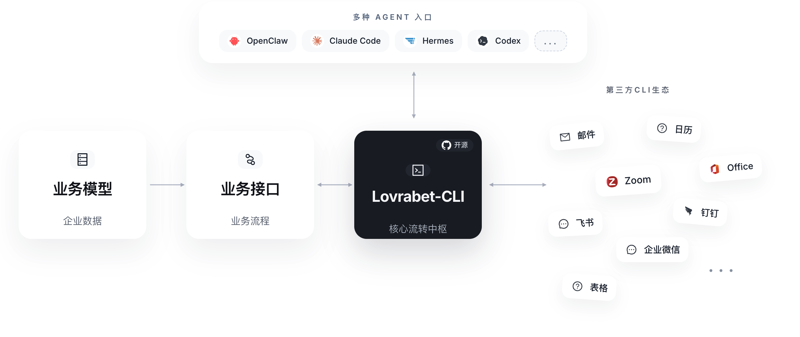

# Lovrabet CLI

[Lovrabet](https://www.lovrabet.com)（中文名云兔）是企业级 AI-Native 业务系统生成平台。`lovrabet` 是面向业务系统运行态的 AI 操作套件，把企业已有系统里的应用目录、数据集、数据操作、SQL、BFF 和诊断能力收束成稳定命令，让 AI Agent、交付实施和业务运维可以从客户、订单、库存、工单等真实业务对象出发，完成查询、核对、执行、联调和排障。

它的价值不是替代后台页面，而是让业务系统从“记录结果”升级为“参与执行”：页面、表单和报表仍是业务承载层，CLI 提供的是 AI 可以理解、调用、审计和复用的操作语义。




这个仓库是 Lovrabet Runtime 能力进入 AI 生态的公开入口：

* `lovrabet` CLI 的公开安装入口
* 面向 AI IDE / Agent 的 `lovrabet` Skill 安装源
* 可二开扩展的命令、流程和交付实践参考

## 安装步骤

### 1. 安装 Lovrabet CLI

```bash
npm install -g @lovrabet/lovrabet-cli@latest
```

安装完成后，可先验证版本和帮助信息：

```bash
lovrabet --version
lovrabet --help
```

### 2. 安装 Lovrabet Skill

如果你在 Cursor、Claude Code、Codex、Windsurf 等支持 `skills` 的 AI 开发环境中使用 Lovrabet，推荐继续安装 Skill：

```bash
npx skills add lovrabet/lovrabet-cli -g -y
```

Skill 会把 Lovrabet 的命令使用顺序、应用决议规则、真实查数方法、风险边界和排障经验提供给 AI 助手，减少乱猜 app、乱猜字段、误用写命令的问题，让一次排查和交付过程可以沉淀为可复用的业务操作经验。

### 3. 登录并开始使用

```bash
lovrabet auth login
lovrabet app list
```

Lovrabet 运行态 CLI 不要求先创建“项目”或初始化本地工程。通常登录后直接通过 `--app` / `--appcode` 指定目标应用，或先用应用目录和数据集搜索完成应用决议。

如需设置一个默认候选应用，可使用：

```bash
lovrabet app use <name>
```

## CLI 能做什么

Lovrabet CLI 主要覆盖这些运行态场景：

* 从真实业务对象出发，做应用决议和数据集定位
* 用 `dataset detail` 看清字段、枚举、关联和返回结构
* 用 `data filter`、`data getOne`、`data aggregate` 做查数、核对和单条定位
* 用 `data create`、`update`、`delete` 做补数、修数和测试数据回灌
* 用 `sql exec` 复用已发布 SQL，做统计口径验证和只读校验
* 用 `bff exec` 复用运行态函数，做业务流程联调和排障
* 把常见查数、核对、联调和排障过程沉淀为 Skill / SOP，供 AI Agent 复用

对于做业务排查、交付联调、数据核对、补数修数、接口验证，CLI 通常比进后台点页面更直接。

## 为什么需要 Lovrabet CLI

传统后台适合人操作页面；AI Agent 需要稳定、可参数化、可审计的业务操作入口。Lovrabet CLI 把运行态能力变成命令域，让企业数据、SQL、BFF、规则和历史经验成为 AI 可以稳定调用的业务资产。

它在 Lovrabet 体系里承担运行态执行引擎的角色：Rabetbase 负责开发态资产建模和接入，Lovrabet CLI 负责把这些资产带到真实业务执行、验证和协作现场，打通从“建模完成”到“业务闭环”的最后一段。

## 推荐上手顺序

```bash
npm install -g @lovrabet/lovrabet-cli@latest
npx skills add lovrabet/lovrabet-cli -g -y
lovrabet auth login
lovrabet app list
lovrabet dataset list --name 客户
lovrabet dataset detail --code <datasetCode>
lovrabet data filter --code <datasetCode> --params '{"currentPage":1,"pageSize":20}'
```

如果要让 AI 助手帮你生成页面、排查字段格式、判断枚举/日期/数组/JSON 的真实结构，优先先跑 `dataset detail`，再跑 `data filter` 或 `data getOne` 看真实返回。

## Skill 适合什么场景

安装 Skill 后，AI 助手更适合处理这些任务：

* 先找正确的 app，再定位 dataset 和字段
* 用真实数据判断枚举、日期、数组、JSON、空值和 `_label` 字段格式
* 区分 `dataset`、`data`、`sql`、`bff` 的职责边界
* 按 Lovrabet CLI 既有约束生成更稳妥的命令和排障步骤

## 仓库结构

```text
README.md
LICENSE
NOTICE
skills/lovrabet/
  SKILL.md
  references/
  guides/
```

## 进一步了解

* 官网：[www.lovrabet.com](https://www.lovrabet.com)
* 开发文档：[open.lovrabet.com](https://open.lovrabet.com/)
* CLI 帮助：`lovrabet --help`
* Skill 说明：[`skills/lovrabet/SKILL.md`](skills/lovrabet/SKILL.md)

## License

Licensed under [Apache-2.0](LICENSE). Redistributions and derivative works must
retain the original copyright, license, and attribution notices required by the
Apache License.
